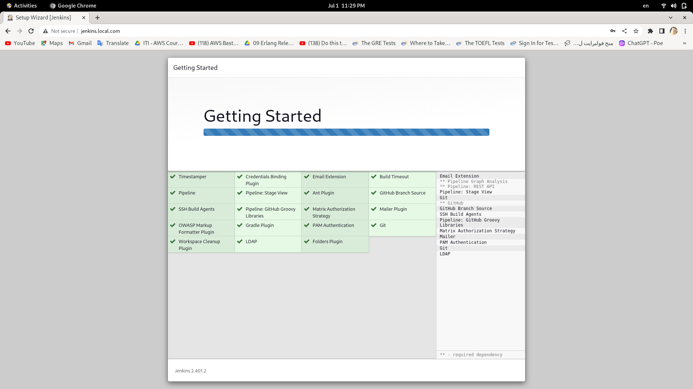

# ITI_Graduation_Project
This repository contains the code and configuration for my graduation project from the ITI (Information Technology Institute). The project focuses on setting up a Kubernetes-based deployment pipeline using Jenkins, Minikube, Terraform, Docker, and Kubernetes.

## Project Overview

The goal of this project is to automate the deployment of a Node.js application and MySQL database on a local Kubernetes cluster. The deployment pipeline is orchestrated using Jenkins, with the infrastructure provisioned using Terraform. Here's an overview of the project's main components and tasks:

1. **Setting up the Kubernetes Cluster:**
   - Utilized Ansible to install and configure Minikube, providing a local Kubernetes instance.
   - Configured two namespaces: "tools" and "dev" using Terraform, each serving a specific purpose in the pipeline.

2. **Namespace and Pod Configuration:**
   - Installed Jenkins and Nexus pods in the "tools" namespace using Terraform. Jenkins serves as the automation engine, while Nexus acts as the container registry.
   - Configured the "dev" namespace to run two pods: one for the Node.js application and another for the MySQL database.

3. **Jenkins Pipeline Job:**
   - Created a Jenkins pipeline job responsible for automating the deployment process.
   - The pipeline performs the following steps:
     - Checks out the source code from the provided GitHub repository: [https://github.com/mahmoud254/jenkins_nodejs_example.git](https://github.com/mahmoud254/jenkins_nodejs_example.git).
     - Builds the Node.js application using the provided Dockerfile.
     - Creates a Docker image for the application.
     - Uploads the Docker image to the Nexus repository for storage.

4. **Docker Container Deployment:**
   - Developed another Jenkins pipeline job to deploy the Docker container on the desired environment.
   - The pipeline retrieves the Docker image from Nexus and deploys it to the specified environment on Minikube.

5. **Configuration Management with Secrets:**
   - Implemented secure handling of microservice configurations using Kubernetes secrets.
   - Stored sensitive configuration information in secrets and updated the microservice pods to access the configurations securely.

## Installing and Configuring Minikube with Ansible

The first step of the project includes an Ansible playbook to automate the installation and configuration of Minikube, allowing you to set up a local Kubernetes cluster effortlessly. The playbook performs the following steps:

1. **Update Apt Cache:**
   - The playbook updates the apt cache on the target system using the `apt` module. This ensures that the system has the latest package information.

2. **Install Dependencies:**
   - Necessary dependencies, such as `apt-transport-https`, `ca-certificates`, `curl`, and `software-properties-common`, are installed using the `apt` module. These packages are required for subsequent steps.

3. **Add Docker GPG Key:**
   - The playbook uses the `apt_key` module to add the GPG key for the Docker repository. This key is necessary to authenticate and verify the packages during installation.

4. **Add Docker Repository:**
   - The `apt_repository` module is used to add the Docker repository to the system's package sources. This step ensures that Docker can be installed from the official Docker repository.

5. **Install Docker:**
   - The playbook installs Docker using the `apt` module. The package `docker-ce` is installed to set up the Docker engine on the target system.

6. **Install Minikube Dependencies:**
   - Required dependencies for Minikube, such as `conntrack`, `ebtables`, and `socat`, are installed using the `apt` module. These dependencies are necessary for Minikube to function properly.

7. **Download Minikube:**
   - The playbook uses the `get_url` module to download the latest Minikube binary for Linux from the official Google Cloud Storage. The downloaded binary is saved as `/usr/local/bin/minikube` and given executable permissions (`0755`).

8. **Start Minikube Cluster:**
   - The playbook starts the Minikube cluster using the `command` module. The command `minikube start --driver=docker --force` starts Minikube with the Docker driver, ensuring a consistent and reliable Kubernetes environment.

9. **Set KUBECONFIG Environment Variable:**
   - The playbook uses the `lineinfile` module to add the `KUBECONFIG` environment variable to the user's `.bashrc` file. This environment variable points to the Kubernetes configuration file (`$HOME/.kube/config`), allowing easy interaction with the Minikube cluster.

Please ensure that the target system meets the necessary requirements and has Ansible installed before executing the playbook.

To run the playbook, use the following command:

```shell
ansible-playbook playbook.yml
```

Add `-i inventory` with your inventory file and `playbook.yml` with the path to the Ansible playbook file in case you would run it against a remote server other than the localhost.
## Terraform Demo


### Start minikube 
- minikube start


### Enable ingress
- Kubernetes Ingress addons are additional components or features that can be installed in a Kubernetes cluster to enhance the functionality of the Ingress resource. Ingress is an API object in Kubernetes that manages external access to services within a cluster.


- Ingress addons provide advanced routing and traffic management capabilities for Kubernetes clusters. They enable features such as load balancing, SSL termination, path-based routing, and more. One popular Ingress addons are:

- Nginx Ingress Controller: This addon uses the Nginx web server as a reverse proxy to handle incoming traffic and route it to the appropriate services based on the defined rules. It supports various load-balancing algorithms, SSL/TLS termination, and other advanced features.

- minikube addons enable ingress


### Terraform init


### Terraform apply


### Terraform state list


### Configure minikube /etc/hosts file
- Map custom hostnames to the IP addresses of services running in Minikube. This allows us to access services using user-friendly names in your local environment.


## Jenkins Demo 


### Open Jenkins 
- use http://jenkins.local.com/ in the browser to open jenkins.


### Get Jenkins Admin Password 
- kubectl get pods -n tools
- kubectl exec -n tools -it jenkins-745954bdbf-shsn9 -- cat /var/jenkins_home/secrets/initialAdminPassword


### Customize Jenkins
- Plugins extend Jenkins with additional features to support many different needs.





### Create the First admin user


### Open Nexus
Write http://nexus.local.com/ in the browser to open nexus


### Get Nexus Admin Password:
- kubectl get pods -n tools
- kubectl exec -it nexus-6b5bd9f4ff-l7tmp -n tools -- cat /nexus-data/admin.password


### Create a Nexus user 


### Create Nexus Repo


### Activate Docker Bearer Token


### Create Jenkins Credentials for Nexus:


### Run Jenkins CI 


### Image pushed to nexus


### Connect to the database
`kubectl get pods -n tools` <br>
`kubectl exec -it mysql-7cccd7f54d-pd6qn -n dev -- mysql -u root -p`

### Create sql user with privileges
```
CREATE USER 'sqluser'@'%' IDENTIFIED BY 'password';
GRANT ALL PRIVILEGES ON *.* TO 'sqluser'@'%' WITH GRANT OPTION;
FLUSH PRIVILEGES;
```

### Connecting to mysql


### Run Jenkins CD 


### App running successfully
use http://nodejs.local.com/ in the browser to open the app.


### Project Done successfully


## Authors 
This repository was built with ❤️ by:<br>
<a href="https://github.com/NadaMarei">- Nada Marei</a>  <a href="https://github.com/mahmoudmohamed22">- Mahmoud Abdelwahab</a> <a href="https://github.com/Mohamed-Sharif">- Mohamed Sharif</a>


